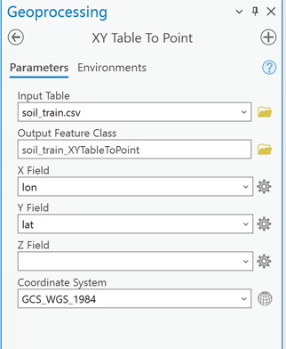
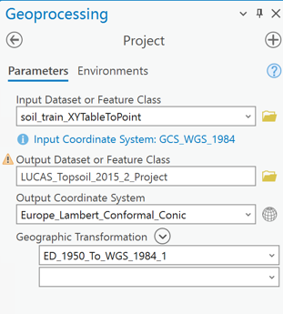
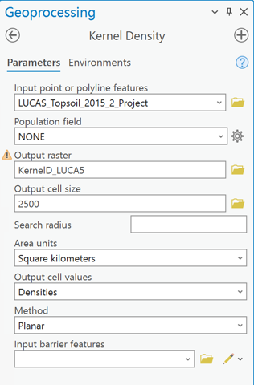

# Guide to Reproducing Paper Results

This document provides a step-by-step guide to reproduce all figures, tables, and key metrics reported in this paper.

## 📍 Prerequisites

Before you begin, please ensure you have installed all necessary Python dependencies as specified in the `Instructions of the Project.md` file in the project's root directory.

All file paths referenced in this document (e.g., `data/...` or `results/...`) are **relative paths** from the project's root directory. All Python scripts should be executed from the root directory.

For steps involving `Arcgis Pro`, we have provided detailed tool parameters.

-----

## 🗺️ Figure 3: LUCAS 2015 Sampling Point Kernel Density Map

### Source Data

  * `data/soil_train.csv`

### Tools Used

  * `Arcgis Pro`

### Procedure

1.  **Import Data Points**:
      * In `Arcgis Pro`, use the `XY Table To Point` tool.
      * Select `data/soil_train.csv` as the Input Table.
      * Set the **X Field** to `lon` and the **Y Field** to `lat`.
      * 
      * Execute the tool to generate a vector point layer of sampling sites.
2.  **Projection**:
      * Use the `Project` tool.
      * Input the point layer generated in the previous step.
      * Name the output file `LUCAS_Topsoil_2015_2_Project`.
      * Set the output coordinate system to: `Europe Lambert Conformal Conic`.
      * 
3.  **Kernel Density Analysis**:
      * Use the `Kernel Density` tool on the projected point layer.
      * Configure the parameters as follows:
        ```
        Input point features:    LUCAS_Topsoil_2015_2_Project
        Population field:        NONE
        Output raster:           KernelD_LUCA5
        Output cell size:        2500
        Search radius:           [Leave blank for default]
        Area units:              SQUARE_KILOMETERS
        Output cell values:      DENSITIES
        Method:                  PLANAR
        ```
      * 
4.  **Symbology (Graduated Colors)**:
      * For the resulting raster `KernelD_LUCA5`, configure the symbology using the intervals and color ramp shown in Figure 3 of the paper.
5.  **Map Finalizing**:
      * Add a basemap (e.g., European country borders), legend, scale bar, and other cartographic elements to finalize the map.

-----

## 📊 Figure 4: Prediction Correlation and Transferability Analysis (SOC)

### Source Data

  * `data/soil_train.csv`

### Tools Used

  * `Python` (and `matplotlib` library) 

### Procedure

1.  **Generate Analysis Results**:
      * Run the main script `model/main_opt.py`.
      * This script will execute the `run_soil_analysis()` function, run the soil organic carbon (SOC) prediction model, and save the analysis results (observed vs. predicted values) to `results/basic_analysis_results.csv`.
      * The relevant code block in `main_opt.py` for this step is :
        ```python
        if __name__ == "__main__":
            # Run basic analyses
            print("Running basic analyses...")
            soil_result = run_soil_analysis()
        ```
2.  **Generate Subplot (a) - Correlation Scatter Plot**:
      * Run the `visualization.py` script.
      * This script will read `results/basic_analysis_results.csv`, call the `visualize_correlation_scatter` function to analyze the `OC` field, and generate the scatter plot `results/figures/prediction_scatter.pdf`.
      * The relevant code block in `visualization.py` for this step is :
        ```python
        if __name__ == "__main__":
            data_path = r"../results/basic_analysis_results.csv"
            visualize_correlation_scatter(data_path, 'OC')
        ```
3.  **Generate Subplots (b-c) - Transferability Analysis**:
      * Run the `evaluate_transferbility.py` script.
      * This script will read `results/basic_analysis_results.csv`, call the `evaluate_model_performance_r2` function, and generate the analysis plot `results/figures/bootstrap_analysis_r2.pdf`.
      * The relevant code block in `evaluate_transferbility.py` for this step is :
        ```python
        if __name__ == "__main__":
            # using example of soil organic carbon prediction
            data_path = r"../results/basic_analysis_results.csv"
            data = pd.read_csv(data_path)
            result = evaluate_model_performance_r2(data['OC'], data['predicted'])
        ```

-----

## 🗺️ Figure 5a: Crime Incident Kernel Density Map

### Source Data

  * `data/Crimes_location.csv` 

### Tools Used

  * `Arcgis Pro` 

### Procedure

1.  **Import Data Points**:
      * Use the `XY Table To Point` tool.
      * Input `data/Crimes_location.csv`, setting the **X Field** to `lon` and **Y Field** to `lat`.
     
2.  **Projection**:
      * Use the `Project` tool.
      * Input the point layer generated in the previous step.
      * Name the output file `Crimes_location_Project`.
      * Set the output coordinate system to: `WGS 1984 UTM Zone 16N`.
    
3.  **Kernel Density Analysis**:
      * Use the `Kernel Density` tool on the projected point layer.
      * Configure the parameters as follows:
        ```
        Input point features:    Crimes_location_Project
        Population field:        NONE
        Output raster:           KernelD_Crim3
        Output cell size:        100
        Search radius:           [Leave blank for default]
        Area units:              SQUARE_KILOMETERS
        Output cell values:      DENSITIES
        Method:                  PLANAR
        ```
4.  **Symbology (Graduated Colors)**:
      * For the resulting raster `KernelD_Crim3`, configure the symbology using the intervals and color ramp shown in Figure 5a.
5.  **Map Finalizing**:
      * Add a basemap, legend, and other cartographic elements to finalize the map.

-----

## 🗺️ Figure 5b: Community Crime Rate Choropleth Map

### Source Data

  * `data/community_crime_stats.xlsx` 
  * `data/CommAreas_20250324.shp` 

### Tools Used

  * `Arcgis Pro` 

### Procedure

1.  **Import Data**:
      * Import `data/community_crime_stats.xlsx` into Arcgis Pro as a table.
      * Add the `data/CommAreas_20250324.shp` (Chicago community area boundaries) layer to the map.
2.  **Join Data**:
      * Right-click the `CommAreas_20250324.shp` layer, select `Joins and Relates` -\> `Add Join`.
      * Select `Community Area` as the field in the shapefile to base the join on.
      * Select `community_crime_stats.xlsx` as the table to join.
      * Select `Community Area` as the field in the table to base the join on.
      * This will append the `CrimeRate` field from the table to the shapefile's attribute table.
3.  **Symbology (Graduated Colors)**:
      * Open the symbology settings for the `CommAreas_20250324.shp` layer.
      * Choose `Graduated Colors`.
      * Select the `CrimeRate` field as the value field.
      * Configure the class breaks and color ramp to match those shown in Figure 5b.
4.  **Map Finalizing**:
      * Add a basemap, legend, and other cartographic elements to finalize the map.

-----

## 📊 Figure 6: Prediction Correlation and Transferability Analysis (Crime)

### Source Data

  * `data/community_crime_stats.xlsx` 

### Tools Used

  * `Python` (and `matplotlib` library) 

### Procedure

1.  **Generate Analysis Results**:
      * Run the main script `model/main_opt.py`.
      * This script will execute the `run_crime_analysis()` function, run the crime rate prediction model, and save the analysis results to `results/basic_analysis_results.csv`.
      * The relevant code block in `main_opt.py` for this step is :
        ```python
        if __name__ == "__main__":
            # Run basic analyses
            print("Running basic analyses...")
            crime_result = run_crime_analysis()
        ```
2.  **Generate Subplot (a) - Correlation Scatter Plot**:
      * Run the `visualization.py` script.
      * This script will read `results/basic_analysis_results.csv`, call the `visualize_correlation_scatter` function to analyze the `CrimeRate` field, and generate the scatter plot `results/figures/prediction_scatter.pdf`.
      * The relevant code block in `visualization.py` for this step is :
        ```python
        if __name__ == "__main__":
            data_path = r"../results/basic_analysis_results.csv"
            visualize_correlation_scatter(data_path, 'CrimeRate')
        ```
3.  **Generate Subplots (b-c) - Transferability Analysis**:
      * Run the `evaluate_transferbility.py` script.
      * This script will read `results/basic_analysis_results.csv`, call the `evaluate_model_performance_r2` function, and generate the analysis plot `results/figures/bootstrap_analysis_r2.pdf`.
      * The relevant code block in `evaluate_transferbility.py` for this step is :
        ```python
        if __name__ == "__main__":
            # using example of crime rate prediction
            data_path = r"../results/basic_analysis_results.csv"
            data = pd.read_csv(data_path)
            result = evaluate_model_performance_r2(data['CrimeRate'], data['predicted'])
        ```

-----

## 🗺️ Figure 7: SDP Case Location Kernel Density Map

### Source Data

  * `data/case_location.csv` 

### Tools Used

  * `Arcgis Pro` 

### Procedure

1.  **Import Data Points**:
      * Use the `XY Table To Point` tool.
      * Input `data/case_location.csv`, setting the **X Field** to `lon` and **Y Field** to `lat`.
2.  **Projection**:
      * Use the `Project` tool.
      * Input the point layer generated in the previous step.
      * Name the output file `case_location_XYTabl_Project`.
      * Set the output coordinate system to: `Krasovsky_1940_Albers`.
3.  **Kernel Density Analysis**:
      * Use the `Kernel Density` tool on the projected point layer.
      * Configure the parameters as follows:
        ```
        Input point features:    case_location_XYTabl_Project
        Population field:        NONE
        Output raster:           KernelD_case1
        Output cell size:        5000
        Search radius:           [Leave blank for default]
        Area units:              SQUARE_KILOMETERS
        Output cell values:      DENSITIES
        Method:                  PLANAR
        ```
4.  **Symbology (Graduated Colors)**:
      * For the resulting raster `KernelD_case1`, configure the symbology using the intervals and color ramp shown in Figure 7.
5.  **Map Finalizing**:
      * Add a basemap, legend, and other cartographic elements to finalize the map.

-----

## 📊 Figure 8: Transferability Analysis (SDP)

### Source Data

  * `data/region.xlsx` 
  * `data/ecpr_case.xlsx` 

### Tools Used

  * `Python` (and `matplotlib` library) 

### Procedure

1.  **Generate Analysis Results**:
      * Run the main script `model/main_opt.py`.
      * This script will execute the `run_sdp_analysis()` function, run the SDP recommendation model, and save the analysis results to `results/basic_analysis_results.csv`.
      * The relevant code block in `main_opt.py` for this step is :
        ```python
        if __name__ == "__main__":
            # Run basic analyses
            print("Running basic analyses...")
            sdp_result = run_sdp_analysis()
        ```
2.  **Generate Subplots (a-b) - Transferability Analysis**:
      * Run the `evaluate_transferbility.py` script.
      * This script will read `results/basic_analysis_results.csv`, call the `evaluate_model_performance_f1` function, and generate the F1-Score analysis plot `results/figures/bootstrap_analysis_f1.pdf`.
      * The relevant code block in `evaluate_transferbility.py` for this step is :
        ```python
        if __name__ == "__main__":
            # using example of sdp recommendation
            data_path = r"../results/basic_analysis_results.csv"
            data = pd.read_csv(data_path)
            result = evaluate_model_performance_f1(data['patterns'].tolist(), data['predicted'].tolist())
        ```

-----

## 📊 Figure 10: Key Influencing Factors Analysis

### Tools Used

  * `Python` (and `matplotlib` library) 
  * `Adobe Illustrator` or other vector graphics software

### Procedure

1.  **Run Key Factor Analysis**:
      * The `model/main_opt.py` script contains the functions to run the key factor analyses.
      * The functions in the `if __name__ == "__main__":` block (e.g., `run_soil_key_factor_analysis`, `run_crime_key_factor_analysis`, `run_sdp_key_factor_analysis`) are used to generate the individual subplots for Figure 10 .
2.  **Generate All Subplots**:
      * You must run the analysis for *each* Context Factor discussed in the paper for all three cases (SOC, crime rate, and SDP).
      * For example, to analyze the `climate_type` factor for the SOC case, run `run_soil_key_factor_analysis('climate_type', 'categorical')`.
      * To analyze the `TotIncome` factor for the Crime case, run `run_crime_key_factor_analysis('TotIncome', 'numerical', 3, 'kmeans')`.
      * To analyze the `climate_type_final` factor for the SDP case, run `run_sdp_key_factor_analysis('climate_type_final', 'categorical', top_k=5)`.
      * Refer to the comments in `main_opt.py`  and repeat this process for *all* factors (e.g., `Topographic Position Index`, etc.).
      * Each run will generate an analysis plot (e.g., `bootstrap_r2_diff.pdf`) in the `results/figures/` directory.
3.  **Assemble the Figure**:
      * Use a graphics tool like `Adobe Illustrator` to arrange and combine all the generated subplots into the final Figure 10 layout as seen in the paper.

-----

## 📋 Table 2: Summary of Model Performance and Transferability

### Source Data

  * This table is derived from the numerical results and metrics generated during the procedures for Figures 4, 6, and 8.

### Procedure

1.  **Data Size**:
      * Compile the statistical count of data samples used for each of the three cases (SOC, Crime, SDP).
2.  **Performance**:
      * Record the **R2** and **F1 Score** metrics. These values are calculated and output (to the console) when running the Python scripts for Figures 4, 6, and 8.
3.  **Effect Size**:
      * Record the **Cohen’s f²** and **SF1G** metrics. These values are also calculated during the execution of the analysis scripts for Figures 4, 6, and 8.
4.  **Interpretation**:
      * Using the classification standards defined in Table 1, find the corresponding qualitative interpretation for the Effect Size values obtained in Step 3.
5.  **Key Influencing Factors**:
      * Based on the results from the Figure 10 analysis, summarize which factors showed a significant difference in model performance for each of the three cases.